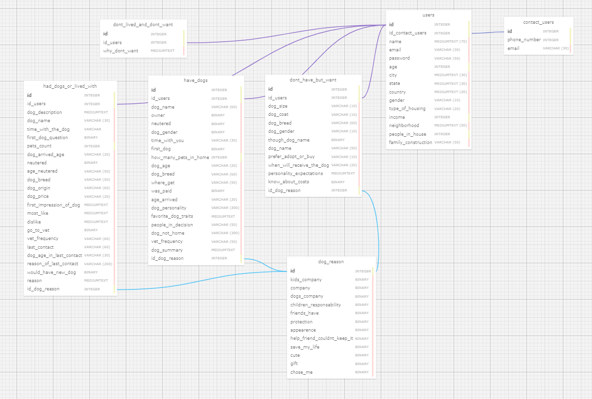
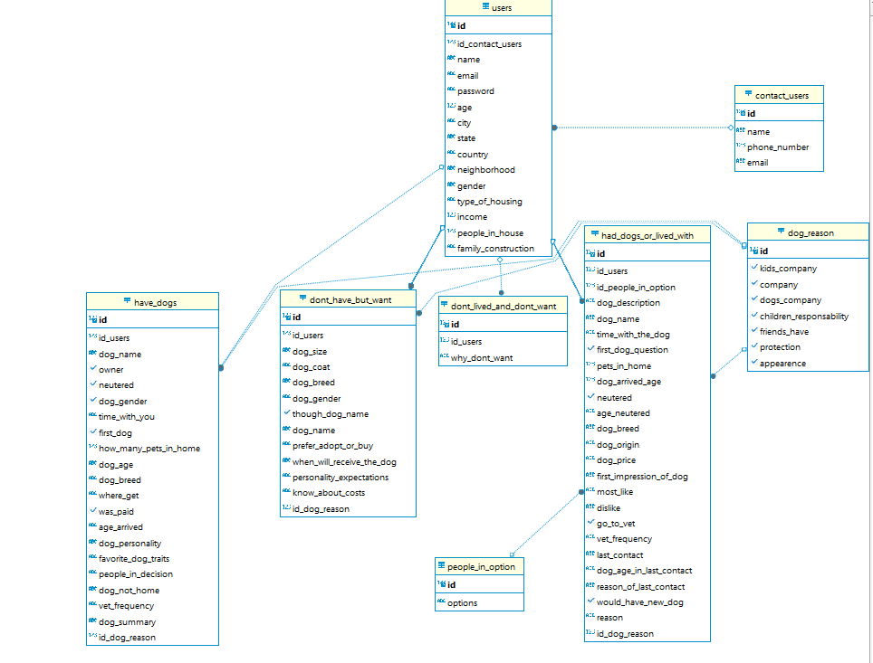

# Atividade ponderada emana 03 - Modelagem do Banco de Dados 

*  **Projeto:** Abandono Zero
* **Data:** 2024-05-10
* **Autor:** Fernando Soares de Oliveira
* **Objetivo:** Descrever o modelo relacional do projeto de forma resumida e simplificada.

# 1. Introdução ao trabalho 
&nbsp;&nbsp;&nbsp;&nbsp; O desenvolvimento de uma aplicação é um processo complexo que envolve várias etapas, cada uma com sua própria responsabilidade em prol de uma aplicação que tenha um bom funcionamento. Sem um planejamento prévio, as chances de uma aplicação se tornar inviável são enormes. Uma das primeiras etapas do processo é a modelagem do banco de dados, pois sem um banco de dados bem estruturado, a aplicação poderá não funcionar de acordo com o esperado. Para se ter um banco de dados bem estruturado, um dos caminhos é através da sua modelagem, que é o processo de transformar um conceito ou ideia em algo lógico e compreensível para computadores. 
&nbsp;&nbsp;&nbsp;&nbsp;A modelagem do banco de dados envolve a definição de estrutura de dados, relações entre essas estruturas e regras de negócios que governam como os dados são armazenados e manipulados. Ao modelar o banco de dados, podemos identificar e resolver problemas de integridade, consistência e escalabilidade, garantindo que a aplicação seja robusta e escalável. Isso auxilia na redução de possíveis erros e bugs, tornando o desenvolvimento mais eficiente e produtivo, contribuindo no baixo custo para a aplicação. 
&nbsp;&nbsp;&nbsp;&nbsp;Inicialmente, é essencial realizar um minucioso levantamento e análise das necessidades dos clientes. Por meio de entrevistas e interações, os requisitos de dados são identificados e documentados, juntamente com as operações que a aplicação deve realizar com esses dados, estabelecendo assim as bases para o desenvolvimento.  
&nbsp;&nbsp;&nbsp;&nbsp;Com base nessas informações, o projeto conceitual é elaborado, fornecendo uma descrição detalhada das entidades envolvidas, seus relacionamentos e as restrições que regem a manipulação dos dados. O Diagrama Entidade-Relacionamento (DER) é uma ferramenta valiosa nesse estágio, permitindo visualizar de forma clara a estrutura dos dados e suas interações. 
&nbsp;&nbsp;&nbsp;&nbsp;A etapa seguinte é a implementação do banco de dados, onde o projeto lógico é concretizado utilizando um Sistema de Gerenciamento de Banco de Dados (SGBD). Aqui, a estrutura de armazenamento e as regras de negócios são definidas, garantindo a integridade e eficiência na manipulação dos dados. 
&nbsp;&nbsp;&nbsp;&nbsp;Por fim, no projeto físico do banco de dados, a estrutura de armazenamento interna e os métodos de acesso aos arquivos são especificados, juntamente com o design das aplicações que irão interagir com os dados. Essas etapas são essenciais para assegurar que a aplicação seja não apenas funcional, mas também escalável, eficiente e capaz de atender às demandas dos usuários de forma eficaz e satisfatória. Ao seguir esse processo de desenvolvimento estruturado, podemos criar aplicações de alta qualidade que atendam às expectativas e necessidades dos clientes de forma satisfatória.

# 2. Modelagem do Banco de Dados do Projeto com o Inspa

# 2.1 Modelo Lógico
&nbsp;&nbsp;&nbsp;&nbsp; Considerando que agora compreendemos como funciona o processo de criação de uma modelagem de banco de dados, vamos passar à apresentação do modelo relacional desenvolvido para o projeto com o Inspa.  
&nbsp;&nbsp;&nbsp;&nbsp; O modelo lógico foi desenvolvido através de sistema de modelagem de dados, conhecido como SQL Designer.

Figura 1 - Modelo Lógico

Fonte: Material produzido pelo autor (2024)

 

# 2.2 Modelo Físico
&nbsp;&nbsp;&nbsp;&nbsp; O modelo físico foi desenvolvido através do software DBeaver. Essa estrutura foi feita com base no modelo lógico, desenvolvido anteriormente, possibilitando que esse modelo fosse feito de forma mais coerente.

Figura 2 - Modelo Físico

Fonte: Material produzido pelo autor (2024)

 

# 3. Conclusão 

# 3.1 Entidades

* Tabela **Users** (<code>users</code>): Armazena informações sobre os usuários do sistema.

     * **id** **(Serial)**: Identificador Único de usuário. (<code>Primary Key</code>)
     * **id_contact_users** **(Integer)**: Identificador Único de contato do usuário. (<code>Foreign Key</code>)
     * **name** **(MediumText (70))**: Nome do usuário. 
     * **email** **(Varchar (30))**: Endereço de email do usuário.
     * **password**  **(Varchar (50))**: Senha definida pelo usuário.
     * **age** **(Integer)**: Idade do usuário.
     * **city** **(MediumText (30))**: Cidade em que o usuário reside.  
     * **state** **(MediumText (30))**: Estado em que o usuário reside. 
     * **country** **(MediumText (20))**: País em que o usuário reside.
     * **neighborhood** **(MediumText (50))**: Bairro em que o usuário reside. 
     * **gender** **(Varchar (10))**: País em que o usuário reside.
     * **type_of_housing** **(Varchar (20))**: Tipo de moradia do usuário.
     * **income** **(Integer)**: Renda do usuário.
     * **people_in_the_house** **(Integer)**: Pessoas morando na mesma residência em que o usuário.
    * **family_construction** **(Varchar (50))**: Construção familiar do usuário. 

* Tabela **Contact Users** (<code>contact_users</code>): Armazena informações de contato dos usuários.

     * **id** **(Serial)**: Identificador Único de contato do usuário. (<code>Primary Key</code>)
     * **id_users** **(Integer)**: Identificador único de usuário, chave primária da tabela <code>users</code>. (<code>Foreign Key</code>)
     * **phone_number** **(Integer)**: Número de telefone do usuário.
     * **email** **(Varchar (30))**: Endereço de email do usuário.

* Tabela **Have Dogs** (<code>have_dogs</code>): Armazena informações dos usuários que possuem cachorros.

    * **id (Serial)**: Identificador único de registro. (<code>Primary Key</code>)
    * **id_users (Integer)**: Identificador único de usuário, chave primária da tabela <code>users</code>. (<code>Foreign Key</code>)
    * **dog_name** **(Varchar (60))**: Nome do cachorro.
    * **dog_gender** **(Binary)**: Sexo do cachorro.
    * **owner** **(Binary)**: Confirma se o usuário é o dono do cachorro.
    * **neutered** **(Binary)**: Confirma se o cachorro é castrado.
    * **time_with_you** **(Varchar (30))**: Tempo do usuário com o cachorro.
    * **first_dog** **(Binary)**: Confirma se o cachorro é o primeiro do usuário ou não. 
    * **how_many_pets_in_home** **(Integer)**: Quantidade de animais presentes na casa do usuário.
    * **dog_age** **(Varchar (30))**: Idade do cachorro. 
    * **dog_breed** **(varchar (60))**: Raça do cachorro. 
    * **where_get** **(Varchar (50))**: Onde o usuário achou o cachorro.
    * **was_paid** **(Binary)**: Confirma se o cachorro foi adquirido através de pagamento ou não.
    * **age_arrived** **(Varchar (20))**: Com quantos anos o cachorro chegou ao usuário.
    * **dog_personality** **(Varchar (300))**: Personalidade do cachorro.
    * **favorite_dog_traits** **(MediumText)**: Características favoritas do cachorro. 
    * **people_in_decision** **(Varchar (50))**: Pessoas envolvidas na decisão da adoção/compra do cachorro.
    * **dog_not_home** **(Varchar (300))**: Verifica se há algum cachorro que não pode ficar na casa.
    * **vet_frequency** **(Varchar (50))**: Frequencia com que o usuário leva o cachorro ao veterinário.
    * **dog_sumary** **(Varchar (300))**: Resumo do cachorro.
    * **id_dog_reason** **(Integer)**: Chave estrangeira vinculada ao ID da razão pra se ter o cachorro. (<code>Foreign Key</code>)

* Tabela **Dog Reason** (<code>dog_reason</code>): Armazena o que motiva o usuário a ter um cachorro.
    * **id (Serial)**: Identificador único do motivo do usuário ter um cachorro. (<code>Primary Key</code>)
    * **kids_company (Binary)**: Cachorro para companhia de criança.
    * **company (Binary)**: Cachorro para companhia própria ou de adultos.
    * **dogs_company (Binary)**: Cachorro para companhia de outro cachorro.
    * **children_responsability (Binary)**: Responsabilidade para crianças.
    * **friends_have (Binary)**: Amigos possuem e influenciaram na escolha.
    * **protection (Binary)**: Cachorro para proteção.
    * **appearence (Binary)**: Aparência do cachorro.
    * ***help_friend_couldnt_keep_it (Binary)**: Ajudar amigo que não conseguiu manter o cachorro.
    * **save_my_life (Binary)**: O cachorro salvou minha vida. 
    * **cute (Binary)**: O cachorro era fofo. 
    * **gift (Binary)**: O cachorro foi um presente.
    * **chose_me**: O cachorro me escolheu.

* Tabela **Had Dogs or Lived With**(<code>had_dogs_or_lived_with</code>): Armazena infomrações sobre usuários que viveram ou tiveram cachorros.
     * **id (Serial)**: Identificador único do registro de quem já possuiu cachorros ou conviveu com. (<code>Primary Key</code>)
     * **id_users (Integer)**: Identificador único de usuário, chave primária da tabela <code>users</code>. (<code>Foreign Key</code>)
     * **dog_description (MediumText)**: Descrição do cachorro. (<code>Foreign Key</code>)
    * **dog_name (Varchar (30))**: Nome do cachorro.
    * **time_with_the_dog (Varchar)**: Tempo com o cachorro. 
    * **first_dog_question (Binary)**: Confirma se esse foi o primeiro cachorro do usuário.
    * **pets_count (Integer)**: Quantos cachorros o usuário possui.
    * **dog_arrived_age (Varchar (20))**: Idade que o cachorro chegou. 
    * **neutered** **(Binary)**: Confirma se o cachorro era castrado.
    * **dog_breed** **(Varchar (50))**: Qual era a raça do cachorro.
    * **neutered** **(Binary)**: Confirma se o cachorro é castrado.
     

